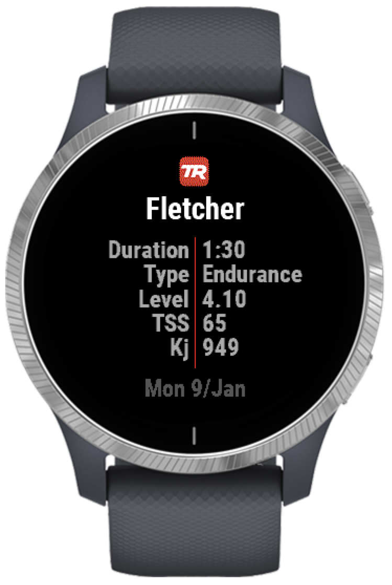
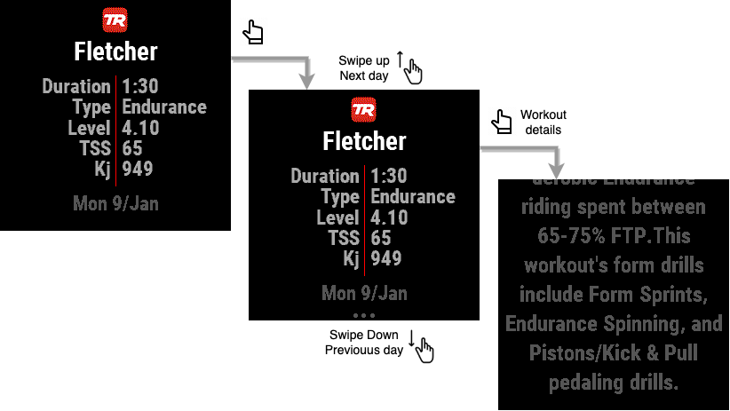
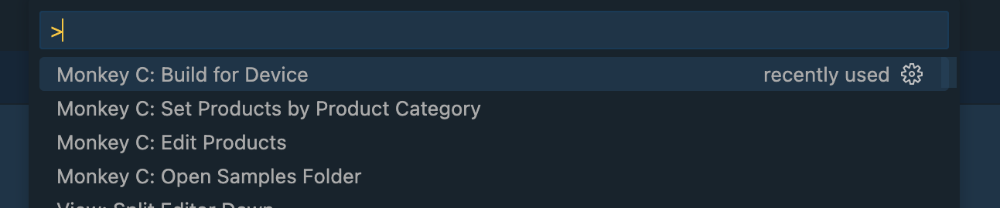
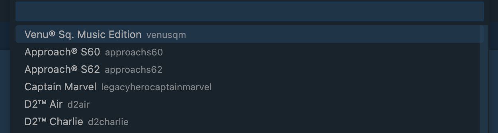
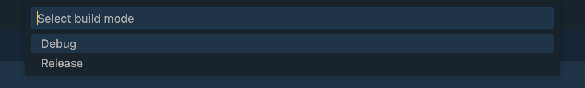
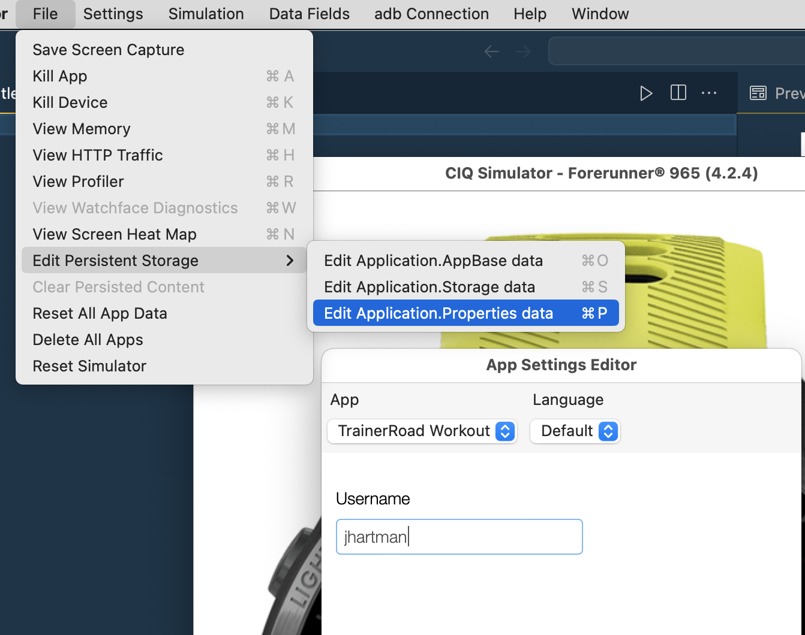
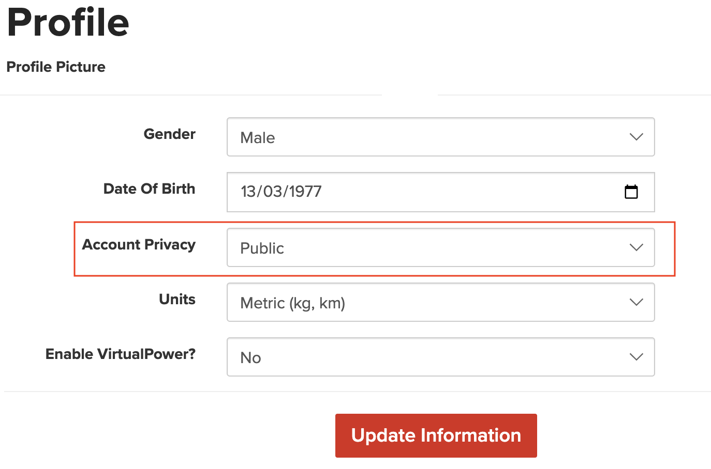
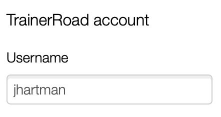
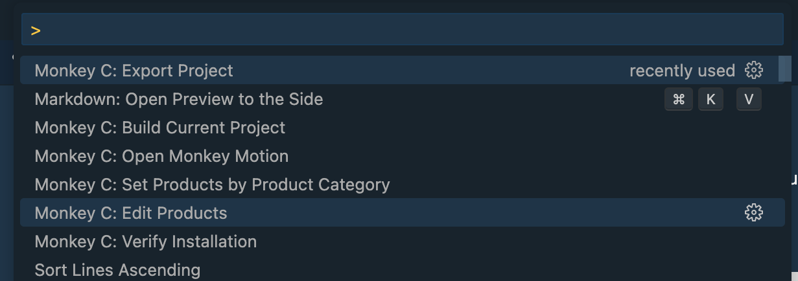
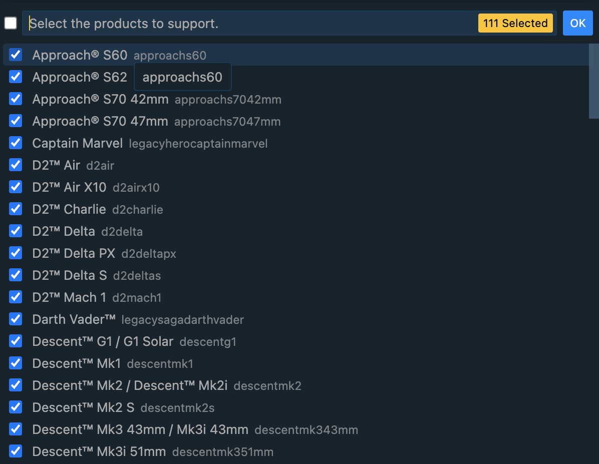

# Background

This small ConnectIQ Widget for Garmin Smart Watches allows you to check your TrainerRoad workout.

    

# Navigation

After installation should be visible in your Widgets carousel. Single tap to enable an option to swipe up or down for next/previous day. Another single tap to jump to the workout details.

# Installation

## From Garmin ConnectIQ store

Get from [Garmin App Store](https://apps.garmin.com/en-US/apps/928e99b2-11fe-4950-9a01-21439f0c7472).

## Build from the source

* Get ConnectIQ SDK from [Garmin](https://developer.garmin.com/connect-iq/sdk/) page.
* Download Visual Studio Code and Visual Studio Code Monkey C Extension
* Build for Device

Select your device:

Debug (or Release - does not matter)

* ConnectIQ simulator

In VisualStudio Code navigate to `bin/TrainerRoadgarminciq.prg` and from the menu select Run -> Start Debugging.

Set your username in Application Properties:

* Upload the file into your Watch

Connect the watch to your PC using USB cable and copy into `GARMIN/APP` folder.

**Note:** For MacOS you would need an MTP application, for example [OpenMTP](https://openmtp.ganeshrvel.com/).

# Settings

**Note:** Privacy settings in [TrainerRoad](https://www.trainerroad.com/app/profile/rider-information) must be set to *Public*:

After installation you need to set your TrainerRoad account name.

* When installed from Garmin ConnectIQ store, use ConnectIQ mobile app on your phone

# Release to Garmin App Store

## Choose supported devices

In VisualStudio Code select `Monkey C: Edit Products`:

Then Export Project to build for all supported devices.

# Support

Your support on Buy Me a Coffee is invaluable, motivating me to continue crafting bytes that matters – thank you sincerely 👍

